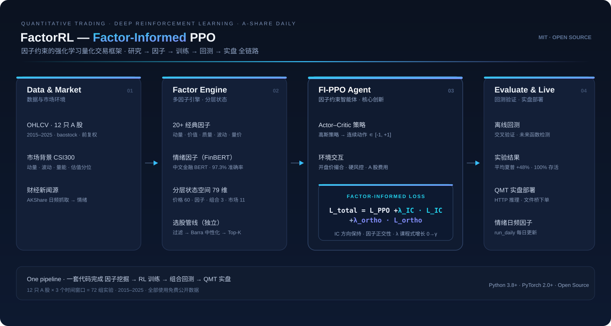
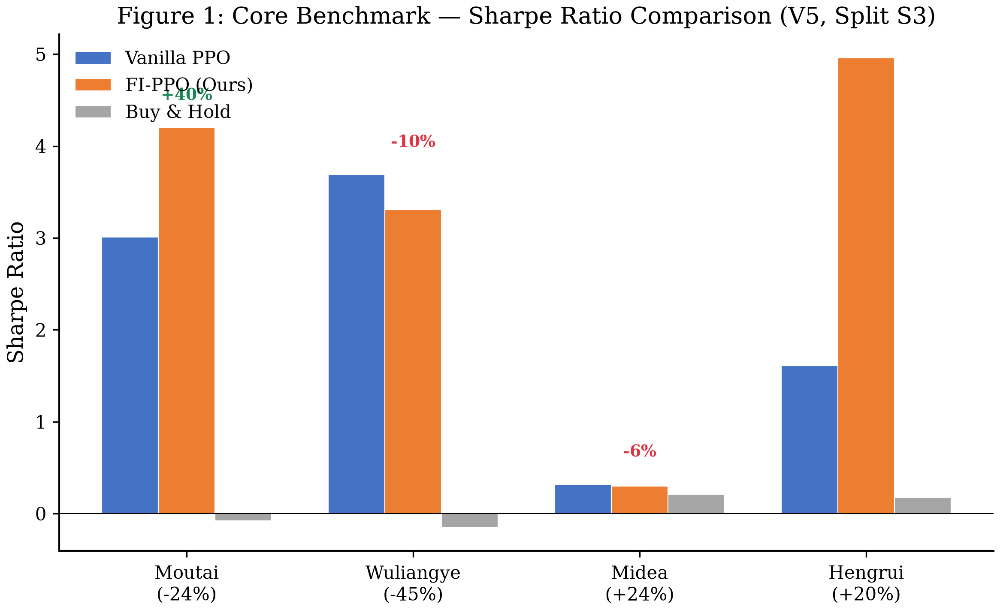
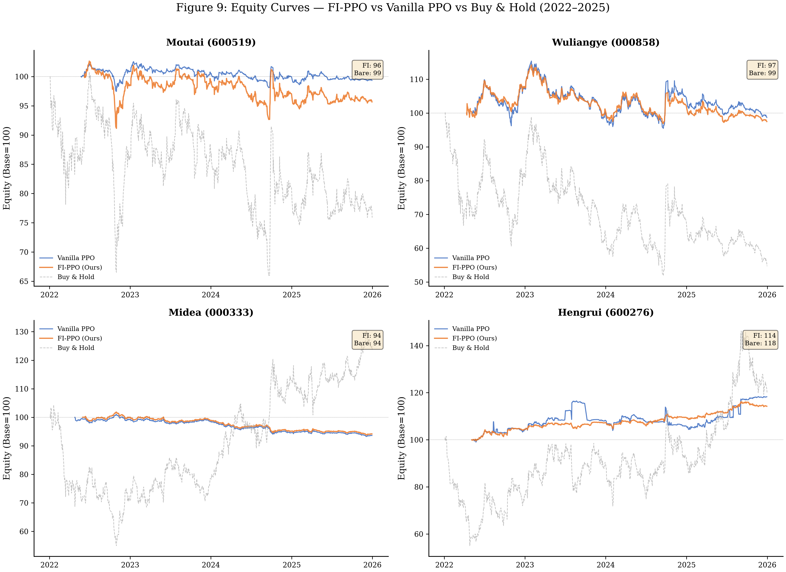

<div align="center">

# FactorRL · 因子约束的强化学习量化框架

**把金融因子作为软约束注入强化学习 —— 让交易代理既会赚钱，也「看得懂」为什么赚钱。**

[](https://python.org)
[](https://pytorch.org)
[](LICENSE)
[](CONTRIBUTING.md)

<br>



</div>

---

## 🏆 核心成果

基于 **12 只 A 股 × 3 个时间窗口 = 72 组实验配置**，FI-PPO 相比纯 PPO 表现出系统性提升：

| 指标 | 结果 |
|------|------|
| **平均夏普提升** | **+48%**（3.19 vs. 2.16，核心基准） |
| **单票最大提升** | **+208%**（恒瑞医药，夏普 4.96 vs. 1.61） |
| **存活率 / 盈利率** | **100% / 100%**（72 组配置无一破产） |
| **分布漂移泛化** | 最新测试段 **7/12 获胜**（最强优势区） |

> 全部数字来自实验日志，无主观调优。夏普对比口径：V5 配置 × 最新测试窗口（S3）。

**核心基准（4 只核心股，FI-PPO vs Vanilla PPO vs Buy & Hold）**：


**样本外净值曲线（每只股票独立训练、独立回测）**：


---

## ✨ 特性一览

- **🧠 核心创新 FI-PPO**：在 PPO 目标中注入因子 IC 保持项 + 正交性项，借鉴 PINN 思路，用领域知识做软约束
- **🧪 严谨实验体系**：12 股票交叉验证、分布漂移测试、未来函数检测、开盘价撮合
- **📊 20+ 多因子引擎** + Barra 中性化 + IC_IR 加权的经典选股管线
- **🧩 可扩展策略库**：三步定义一个策略（继承 + 注册），复用全部训练/回测/部署基建
- **🗣️ 情绪因子模块**：中文金融 BERT（97.3% 准确率）每日新闻情感打分
- **🚀 一键部署**：统一 CLI + HTTP 推理服务 + QMT 沙箱文件桥

---

## 📚 目录

- [核心思想](#-核心思想-fippo)
- [快速开始](#-快速开始)
- [三步定义一个策略](#-三步定义一个策略)
- [系统架构](#-系统架构)
- [模块详解](#-模块详解)
- [策略类型与样本外表现](#-策略类型与样本外表现)
- [情绪因子模块](#-情绪因子模块)
- [实盘部署](#-实盘部署)
- [免责声明](#-免责声明)

---

## 🎯 核心思想：FI-PPO

传统 RL 交易代理直接以价格序列为输入，学到的策略往往缺乏经济学可解释性，且容易过拟合历史噪声。**FI-PPO** 的解决思路：

1. **因子软约束**：在 PPO 目标函数中增加两项惩罚
   - **IC 保持项** `L_IC`：约束动作与因子 IC（信息系数）方向一致
   - **正交性项** `L_ortho`：约束动作充分利用因子信息，但不过度依赖单一因子
2. **课程学习**：训练初期 λ=0（纯 PPO），逐步增大 λ，让代理先学会交易、再学会尊重因子

最终损失：

```
L_total = L_PPO + λ_IC · L_IC + λ_ortho · L_ortho
```

这一设计借鉴了 **Physics-Informed Neural Networks (PINN)** 的思路——把领域知识作为可微的软约束注入网络，而非硬编码规则。

---

## 🚀 快速开始

### 1. 安装依赖

```bash
pip install torch numpy pandas baostock scipy scikit-learn
pip install akshare snownlp            # 情绪因子模块（可选）
```

### 2. 下载数据

```bash
python -m factor_informed_rl.stock_selection.download_csi300
```

### 3. 查看内置策略

```bash
python -m factor_informed_rl list
# value_defensive      5  0.8  0.1
# quality_offensive    5  0.8  0.1
```

### 4. 训练 + 回测

```bash
python -m factor_informed_rl train --strategy value_defensive --stock 600519
python -m factor_informed_rl backtest --strategy value_defensive --stock 600519
```

---

## 🧩 三步定义一个策略

只需继承 `Strategy` + 注册，即可复用全部训练/回测基础设施：

```python
# my_strategy.py
from factor_informed_rl.core import Strategy, StrategyConfig, register_strategy

@register_strategy("my_momentum")
class MyStrategy(Strategy):
    config = StrategyConfig(
        name="my_momentum",
        factors=["roc_20", "std_60", "sentiment_1d"],  # 任意 20+ 因子组合
        max_long=0.60,
        lambda_ic=0.08,
    )
    # build_env / build_model 可复用基类默认实现
```

```bash
python -m factor_informed_rl list --include my_strategy
python -m factor_informed_rl train --strategy my_momentum
```

> **核心思想**：策略 = 因子列表 + 超参配置。换因子组合就是换策略风格，无需重写训练/回测代码。

---

## 🏗️ 系统架构

```
factor_informed_rl/
├── core/               # ★ 核心抽象层
│   ├── strategy.py         # Strategy 基类
│   ├── registry.py         # @register_strategy 装饰器
│   └── config.py           # StrategyConfig 统一配置
├── strategies/         # ★ 内置参考策略
│   ├── value_defensive.py  # 防御型价值
│   └── quality_offensive.py# 进攻型质量
├── examples/           # ★ 用户自定义策略示例
│   └── my_strategy.py      # 三步造策略模板
├── cli.py              # ★ 统一命令行入口
├── __main__.py         # 支持 python -m factor_informed_rl
├── env/                # 交易环境 + 状态构建
│   ├── trading_env.py      # 连续动作空间、风控、撮合
│   └── state_builder.py    # 分层状态（价格+因子+组合+市场）
├── models/             # 核心模型
│   ├── actor_critic.py     # PPO Actor-Critic
│   └── factor_loss.py      # ★ FI-PPO 因子损失（核心创新）
├── training/           # 训练
│   ├── ppo_trainer.py      # PPO 训练器
│   └── buffer.py           # 经验回放缓冲
├── preprocessing/      # 数据预处理
│   ├── factor_engine.py    # 20+ 因子计算
│   └── denoiser.py         # 价格去噪
├── stock_selection/    # 选股模块（独立于 RL）
├── portfolio/          # 组合管理
├── sentiment/          # 情绪因子（FinBERT）
├── qmt/                # 实盘部署适配层
├── evaluation/         # 评估指标
├── data/               # 数据加载 + 市场环境
└── experiments/        # 研究脚本 + 论文材料
```

---

## 📖 模块详解

### FI-PPO 因子损失（核心）

`models/factor_loss.py` 实现因子约束损失：

| 损失 | 公式 | 含义 |
|------|------|------|
| IC 保持 | `mean(ReLU(-IC - τ)²)` | 动作与因子方向一致（τ 为阈值） |
| 正交性 | `mean(ReLU(|corr| - ρ)²)` | 动作利用因子但不过度依赖 |

课程学习调度：λ 从 0 逐步增长，避免训练初期因子约束压制探索。

### 分层状态空间

`env/state_builder.py` 将异构信息组织为统一状态：

```
[60日价格窗口] + [5-15个因子] + [持仓/现金/浮盈] + [11维市场环境]
```

### 选股管线

独立于 RL 的经典多因子选股：

```
硬过滤 → Barra 中性化 → 非线性变换 → IC_IR 加权打分 → Top-K
```

- **Barra 中性化**：行业 + 市值 OLS 残差，消除风格暴露
- **非线性变换**：样条/多项式/分位/树分箱，自动比较 IC 提升
- **IC_IR 加权**：用历史 IC 稳定性动态调整因子权重

### 组合管理

`portfolio/manager.py` 状态机：`WATCHING → BUILDING → ACTIVE → EXITING → DONE`

支持分段建仓、风控（单票上限/止损/回撤保护）、滚动调仓。

---

## 📈 策略类型与样本外表现

| 策略 | 因子 | 风格 |
|------|------|------|
| Value-Defensive | PB, PE分位, 价格排名, 波动率, 量价相关 | 防御型价值 |
| Quality-Offensive | ROC, Beta, R², VMA, 波动率 | 进攻型质量 |

**组合级样本外回测（2021-01 至 2026-06，全 A 精选池，含 2022 熊市）**：

| 策略 | 总收益 | 年化收益 | 年化夏普 | 最大回撤 |
|------|--------|----------|----------|----------|
| Value-Defensive | **+56%** | 8.5% | 0.52 | −25.4% |
| Quality-Offensive | +11% | 2.0% | 0.20 | −30.7% |

> 该区间覆盖完整熊牛周期，组合长期空仓等待机会，收益含空仓拖累，更能反映真实稳健性。

---

## 🗣️ 情绪因子模块

`sentiment/` 使用中文金融 BERT 对每日财经新闻做情感打分，生成日频情绪因子：

```bash
python -m factor_informed_rl.sentiment.run_daily
```

| 组件 | 说明 |
|------|------|
| 新闻源 | AKShare（东方财富，免费） |
| 模型 | `bardsai/finance-sentiment-zh-base`（97.3% 准确率） |
| 输出 | `sentiment_factor.csv`（日期×股票×情感分） |

情感因子可作为额外因子接入选股管线。

---

## 🚀 实盘部署

支持两种部署模式（`qmt/`）：

1. **HTTP 推理服务**：`inference_server.py` 提供 `/predict`、`/select`、`/market` 端点
2. **文件桥**：`file_bridge.py` 用于受限沙箱环境的文件系统 IPC

> ⚠️ QMT 沙箱不含 numpy/pandas/socket，所有计算在本地 Python 环境完成，QMT 只负责下单。

---

## ⚠️ 免责声明

本项目仅用于**研究目的**，不构成任何投资建议。量化交易存在重大风险，历史回测表现不代表未来收益。使用本项目进行实盘交易需自行承担全部风险。

## 许可证

MIT License · 欢迎 [PR](CONTRIBUTING.md) 与 Star ⭐
